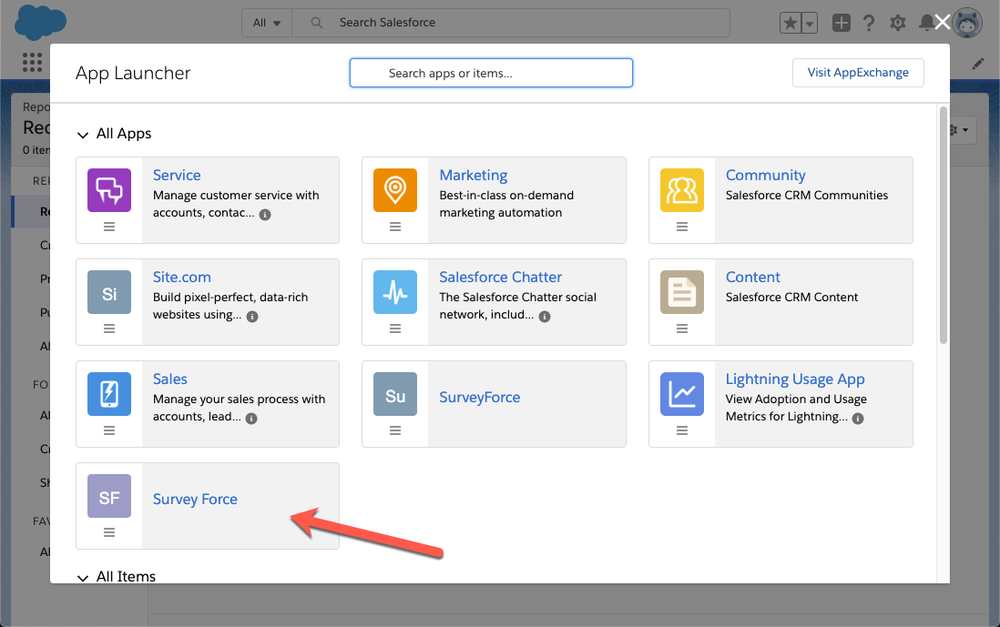
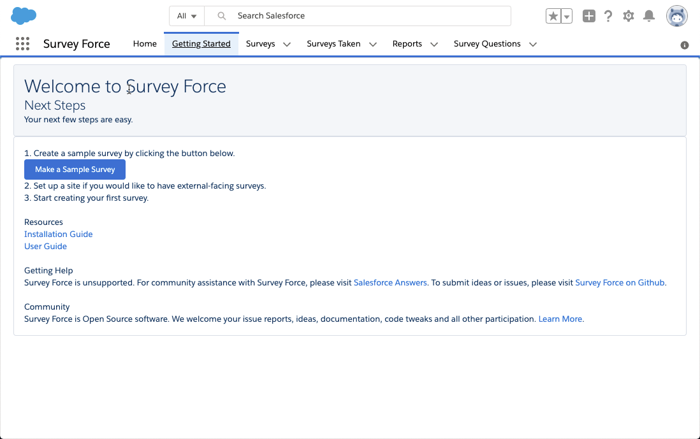
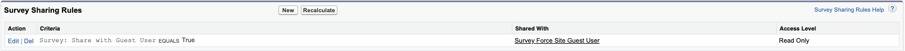

# Post Install Guide - Public Facing Surveys

## Instalation & Setup
- ["Install Survey Force"](https://appexchange.salesforce.com/appxListingDetail?listingId=a0N30000003I2gDEAS)
- Assign "Survey Force - Admin" permission set to administrator
- Assign "Survey Force - Guest" permission set to Force.com site guest user (Complete steps on Force.com site configuration below)

## General Surveys

1. Go to "Survey Force App"

1. Open "Getting Started" page

1. CLick "Make a Sample Survey"
1. Click "View Sample Survey"

You should be able to see survey, add questions, edit CSS, share survey with users and see results. Test this survey by sending it to users. In case of errors, check user permissions to appropriate survey objects. There are 4 Survey objets that you need to check.

Make sure that you check access for Force.com site guest user if you plan to embed this survey in Force.com site.

- Survey
- Survey Question Response
- Survey Taken
- Survey Question

## Surveys in Force.com sites

1. Create a Force.com Site. [Details, including "Creating a Force.com Site"](https://help.salesforce.com/articleView?id=sites_setup_overview.htm&type=5)
1. You can assign "Survey Force - Guest" permission set to this site's guest user
   - You need to activate the site otherwise guest user will not be activated and you cannot assign permission set
   - You will get "Your account has been disabled" error
1. OR you can manually assign all the permission to Guest user profile or create a new permission set 
   1. Modify your Site's ["Public Access Settings"](https://help.salesforce.com/articleView?id=sites_public_access_settings.htm&type=5)
   1. Check "Read" access to "Survey" and "Survey Question" object.
   1. Check "Read" and "Create" access for "Surveys Taken" and "Survey Question Responses"
   1. Check "Read" and "Create" access for "Surveys Taken" and "Survey Question Responses"
1. Make sure to provide Read/Edit access (as applicable) to all fields  in above objects. Otherwise guest users may see "Unauthorized Error" because of field access violation.
1. Add the Visualforce page, "Take Survey" to the list of enabled Visualforce pages.
1. Create a Sharing Rule for "Survey" in Setup->Sharing Settings. Allow Read access to "Guest" user where "Publicly Available" (Field:Survey__c.Share_with_Guest_User__c) is True (or any other criteria)
   1. Without this, Guest user cannot see Survey object becasue of new Guest user restrictions
   1. See below for details

## Survey Connecting to Contact or Case Records

1. Complete "General Surveys" steps.
1. Check "Read" access for "Contact" object.
1. Check "Read" access for "Case" object.
1. Private OWD for Case and Contact ?
   1. Create a public group and add the survey site user. 
   1. Grant read access to case and contact to this group by creating 2 sharing rules
   1. [Check this thread for further information.](http://boards.developerforce.com/t5/Force-com-Labs-Development-and/Survey-Force-Question/m-p/407457#M1197)

 ## Extra Notes
 Following notes were posted by "Cynthia Chen" on https://appexchange.salesforce.com/listingDetail?listingId=a0N30000003I2gDEAS&revId=a0S3A00000Jk9SvUAJ&tab=r

 1. Error on viewing the report results of the survey: error messages "The report ID and the developer name are not defined. Provide either the report ID or the developer name for the report that contains the chart." and "List has no rows for assignment to SObject"
    - It is because the user has no permission to see the report "Survey with Questions and Responses“, share the report folder to the user will solve this error. If want to share this report to all internal users, create a Public Group and add All Internal Users will be OK. (Enable automatic access to records using role hierarchies for public groups by selecting Grant Access Using Hierarchies when creating the group. However, don’t use this option if you’re creating a public group with All Internal Users as members.)(The all internal user group is created only after portals/community are enabled.)

2. If want put image in the survey title and bottom and let the survey taker see the iamges,
   - Sites > SurveyForcePublicSite > Public Access Settings > Field-Level Security > look for the survey object > view > give reading permissions to the header： Survey Header

3. "Secure guest user record access": Enabling this will stop Guest user access to Salesforce org data. Enabling this may result in Guest user not having access to Survey Force records. More details are at: https://help.salesforce.com/articleView?id=networks_secure_guest_user_sharing.htm&type=5. Be careful when enabling this feature.
   * In future, you will not be able to give view/modify all permissions to Guest users
   * For this to work, DML code for Guest user has been moved to a without sharing class (ViewSurveyControllerWithoutSharing.cls)
   * Create a sharing rule to allow read access to Survey object (and all child objects that includes Survey Questions)
     * This is for Guest user to be able to view Survey and Survey Questions
   
   * This sharing rule is based on a new field added to Survey__c object which will be True by default. To remove access from Guest user, you can change the default check option OR create a Process Builder process or trigger to remove it conditionally based on data
   * Do NOT assign Guest user as Owner of Sharing rule (only sharing rule is needed)
   
 
## Upgrade Options
 
### Upgrading the package
Unfortunately, Survey Force is un-managed package and cannot be upgraded as per standard package upgrade process. To use this, you need to un-install existing package and install the latest version. However, you will loose your existing data.

### Upgrading the source code
Because this is an un-managed package, you have to upgrade your source code directly. Following is one way you can upgrade with source code however extensive testing is highly recommended.
#### GitHub Repo
- Pull source from this GitHub repo from "master" branch
- Push this code to a sandbox
-- Ensure to keep track of any custom changes you may have made to this application and implement those changes again
- Test all the new changes 
- Once testing is complete, push those changes to product and re-test

#### Pcakage installation
- In sandbox, you can uninstall older package version
- Install latest package from AppExchange
-- Ensure to keep track of any custom changes you may have made to this application and implement those changes again
- Test all the new changes 
- Once testing is complete, push those changes to product and re-test 
